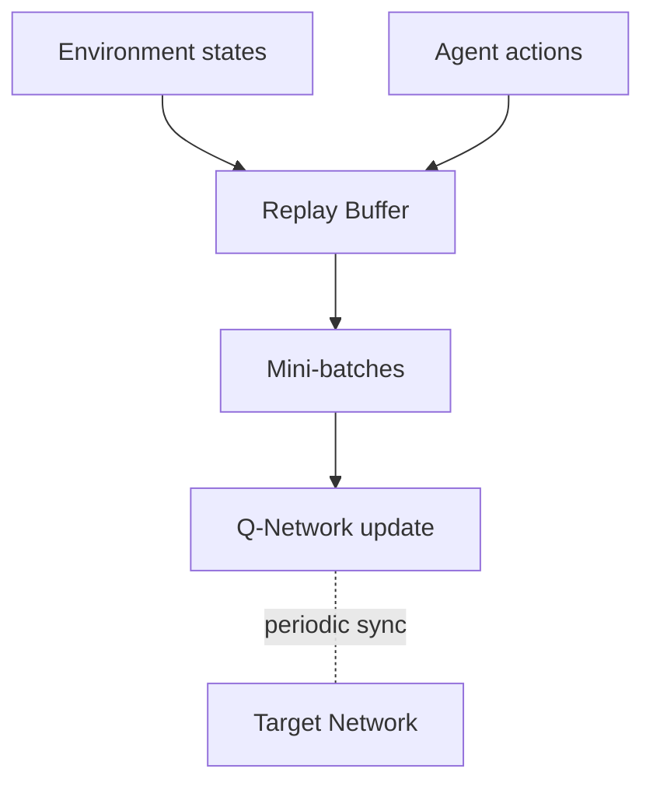

# Deep Reinforcement Learning (DRL)

Deep Reinforcement Learning (DRL) combines **reinforcement learning (RL)** with **deep neural networks** to learn decision-making policies through interaction with an environment, aiming to **maximize cumulative reward**.

---

## 1. Core Concepts
- **Agent**: Learns and acts.
- **Environment**: World the agent interacts with.
- **State (s)**: Information describing the environment at time *t*.
- **Action (a)**: Choice the agent makes.
- **Reward (r)**: Scalar feedback signal.
- **Policy (π)**: Mapping from states to actions; can be stochastic π(a|s).
- **Trajectory (τ)**: Sequence (s₀, a₀, r₀, s₁, a₁, r₁, ...).
- **Return (Gₜ)**: Discounted cumulative reward:  
  \[ G_t = \sum_{k=0}^{\infty} \gamma^k r_{t+k+1} \]
- **Value Function**: Expected return from state s:  
  \[ V^{\pi}(s) = \mathbb{E}_{\pi}[G_t | s_t=s] \]
- **Action-Value (Q) Function**: Expected return from (s,a):  
  \[ Q^{\pi}(s,a) = \mathbb{E}_{\pi}[G_t | s_t=s, a_t=a] \]

---

## 2. Why "Deep"?
Traditional RL struggles with **high-dimensional observations** (e.g., images). **Deep networks** (CNNs, RNNs, Transformers) act as function approximators for policies, value functions, and models, enabling learning directly from raw inputs.

---

## 3. Learning Objectives
- **Value-based**: Learn Q(s,a); derive policy by argmax (e.g., DQN).
- **Policy-based**: Optimize π(a|s) directly via gradient ascent (REINFORCE).
- **Actor–Critic**: Learn both policy (actor) and value (critic) for variance and stability benefits (A2C/A3C, PPO, SAC).

---

## 4. Canonical Algorithms

### 4.1 Deep Q-Network (DQN)
Approximates Q(s,a; θ) with a deep network.
- **Update rule**:  
  \[ y = r + \gamma\,\max_{a'} Q_{\text{target}}(s', a'; \theta^-) \]  
  Minimize:  
  \[ L(\theta) = \big(y - Q(s,a;\theta)\big)^2 \]
- **Stabilizers**: Experience replay buffer, target network.
- **Extensions**: Double DQN, Dueling networks, Prioritized replay.

### 4.2 Policy Gradient (REINFORCE)
Maximize expected return:  
\[ J(\theta) = \mathbb{E}_{\tau\sim\pi_\theta}[G]\]
Gradient estimator:  
\[ \nabla_\theta J(\theta) = \mathbb{E}[\nabla_\theta \log \pi_\theta(a|s)\, G_t] \]
Use a **baseline** b(s) (often V(s)) to reduce variance:  
\[ \mathbb{E}[\nabla_\theta \log \pi_\theta(a|s)\,(G_t - b(s))] \]

### 4.3 Actor–Critic (A2C/A3C)
- **Actor** updates by advantage \(A(s,a)=Q(s,a)-V(s)\).
- **Critic** learns V(s) via TD error:  
  \[ \delta = r + \gamma V(s') - V(s) \]
Parallel workers (A3C) stabilize training.

### 4.4 Proximal Policy Optimization (PPO)
Clipped surrogate objective to avoid destructive updates:  
\[ L(\theta) = \mathbb{E}\Big[ \min\big( r_t(\theta) A_t, \text{clip}(r_t(\theta), 1-\epsilon, 1+\epsilon) A_t \big) \Big] \]  
where \( r_t(\theta) = \frac{\pi_\theta(a_t|s_t)}{\pi_{\theta_{old}}(a_t|s_t)} \).

### 4.5 Soft Actor–Critic (SAC)
Maximizes expected return **and** entropy for exploration:  
\[ J(\pi) = \mathbb{E}\big[ Q(s,a) - \alpha\, \log \pi(a|s) \big] \]
Uses **stochastic** policies and temperature α.

---

## 5. Training Loop (Pseudo-code)
```python
for episode in range(num_episodes):
    state = env.reset()
    done = False
    while not done:
        action = policy.sample(state)  # epsilon-greedy for DQN, stochastic for actor
        next_state, reward, done, info = env.step(action)
        replay_buffer.add(state, action, reward, next_state, done)
        state = next_state
        # periodically update networks from mini-batches
        if time_to_update():
            batch = replay_buffer.sample(batch_size)
            update_networks(batch)  # compute targets, losses, gradients
```

---

## 6. Practical Recipes & Tips
- **Reward shaping**: Keep simple and aligned with the objective; avoid unintended shortcuts.
- **Exploration**: ε-greedy, entropy bonuses, parameter noise, curiosity/ICM.
- **Stability**: Normalize observations, clip gradients, orthogonal init, target networks.
- **Sample efficiency**: Prioritized replay, model-based rollouts, offline RL.
- **Hyperparameters**: Learning rate, discount γ, batch size, update frequency, entropy coeff.
- **Evaluation**: Use deterministic eval policy, track average return and success rate.

---

## 7. Representative Examples

### 7.1 Atari from Pixels (DQN)
- **Task**: Play Atari games (e.g., Breakout) from raw 84×84 grayscale frames.
- **Architecture**: Convolutional network → fully connected → Q-values over actions.
- **Outcome**: Agents learn strategies like aiming the ball to break through walls.

### 7.2 Go Playing (Policy + Value Nets)
- **Task**: Play Go at superhuman level (AlphaGo/AlphaZero-style training).
- **Approach**: Policy network proposes moves; value network evaluates positions; Monte Carlo Tree Search (MCTS) guides exploration.

### 7.3 Robotic Manipulation (Actor–Critic)
- **Task**: Grasp and place diverse objects.
- **Signals**: Sparse rewards for task completion; use curriculum or HER (Hindsight Experience Replay) to learn from failures.

### 7.4 Autonomous Driving (SAC/PPO)
- **Task**: Lane keeping, merging, and obstacle avoidance in simulation.
- **Objective**: Smooth control, safety constraints, and comfort via multi-objective rewards.

### 7.5 Resource Management (PPO)
- **Task**: Dynamic scheduling in cloud clusters.
- **Reward**: Throughput, latency reduction, energy efficiency.

---

## 8. Diagrams (Mermaid)

### 8.1 DRL Interaction Loop
```mermaid
flowchart LR
    A[Agent (Policy/Value NN)] -->|Action a_t| B[Environment]
    B -->|Next state s_{t+1} & reward r_t| A
```

### 8.2 DQN Training Data Flow


---

## 9. Common Pitfalls
- **Reward hacking**: Agent exploits loopholes in reward design.
- **Overestimation bias**: In Q-learning; mitigated by Double DQN.
- **Catastrophic forgetting**: Non-stationary data; use replay and target nets.
- **Distribution shift**: Offline RL must handle dataset bias.

---

## 10. Glossary
- **HER**: Relabel failed trajectories with alternate goals.
- **MCTS**: Tree search using learned priors and value estimates.
- **TD Error**: Temporal-difference error used to update value estimates.
- **Advantage**: A(s,a)=Q(s,a)-V(s), measures action’s relative merit.
- **Entropy Regularization**: Encourages exploration by penalizing certainty.

---

## 11. Minimal References (for further reading)
- Sutton & Barto, *Reinforcement Learning: An Introduction*, 2nd ed.
- Mnih et al., 2015, "Human-level control through deep reinforcement learning" (DQN).
- Schulman et al., 2017, "Proximal Policy Optimization Algorithms".
- Haarnoja et al., 2018, "Soft Actor-Critic: Off-Policy Maximum Entropy RL".

---

## 12. Quick Start Checklist
- Choose **algorithm** (DQN/PPO/SAC) based on action space and reward density.
- Define **observations** & normalize.
- Design **reward** and **termination** conditions.
- Implement **logging** (returns, losses, success metrics).
- Iterate with **hyperparameter sweeps**.

